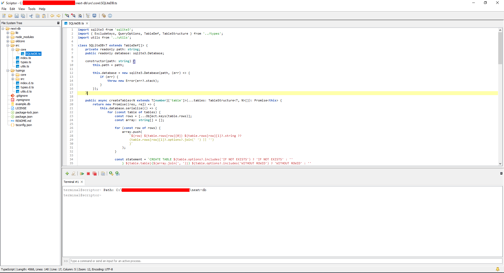

# Scriptor

Scriptor is a powerful and open-source IDE based on Java Swing. It provides many features, fully customizable, and beginner-friendly!

- Syntax highlighting
- Autocomplete*
- File system tree
- Built-in terminal
- Plugins and themes
- SQLite and Markdown viewer

*: Still under development.

## 📥 Download

To download Scriptor, simply go to [releases](https://github.com/TFAGaming/Scriptor/releases), choose which version you want to download, click on assets, and then on the **.zip** file to download it. When the download finishes, unzip the compressed folder to a normal folder and start the application by opening the file **Scriptor.exe**.

> [!WARNING]  
> Do not mess with the resources and plugins folder; it has all required files for the application to run.

## 🖼️ Screenshots

## 📄 License
[The **MIT** License](./LICENSE)